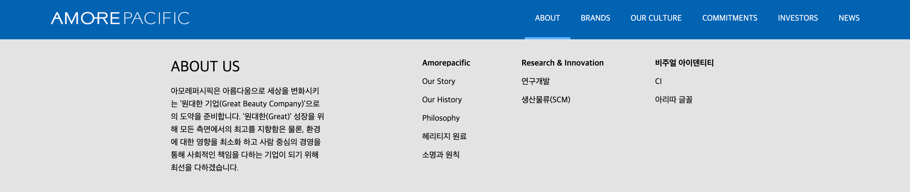
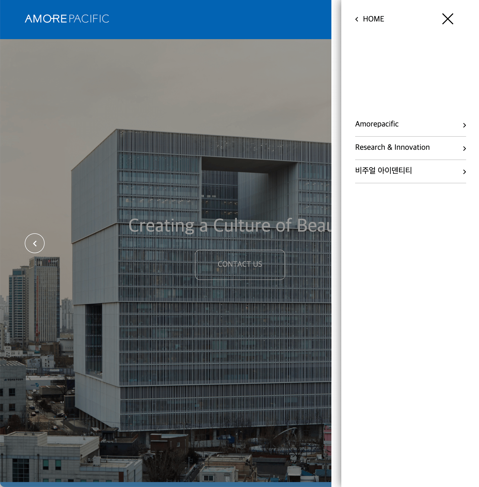
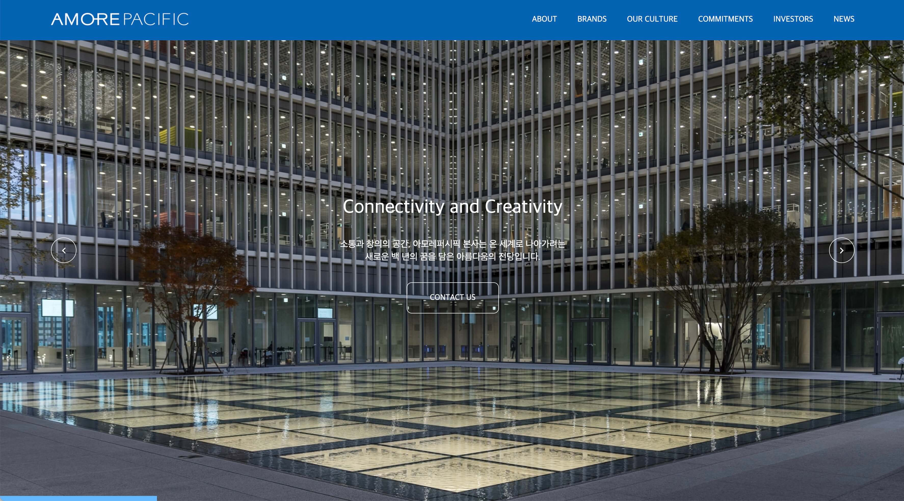
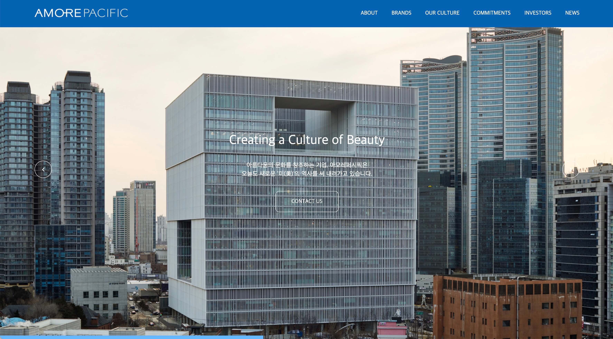
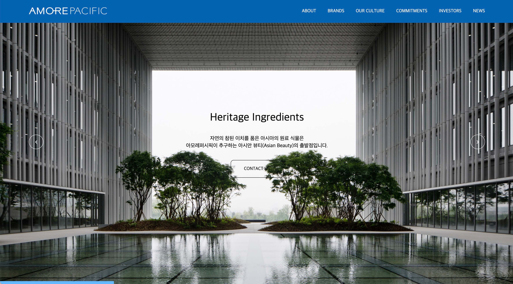
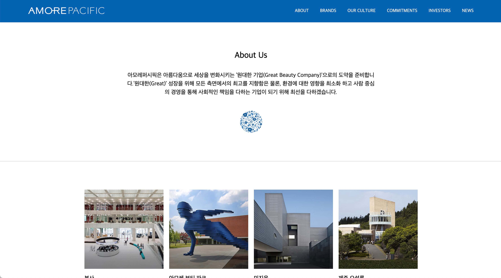
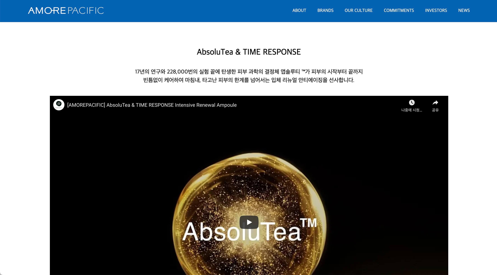
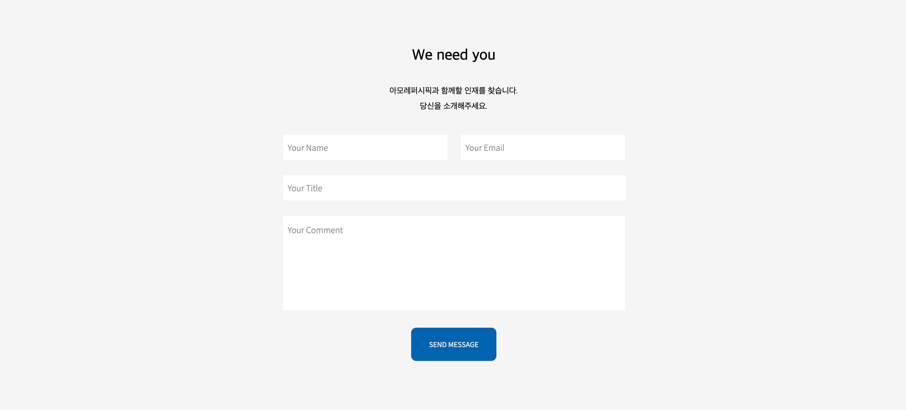

# Amorepacific
아모레퍼시픽 프로모션 웹사이트입니다.   
프로그래밍 작업이 목적이기에 기존 아모레퍼시픽 웹사이트를 참고하였고 일부 디자인은 수정하였습니다.   

## 사용 언어
 - HTML, CSS, JavaScript 
### 중점 작업  
1. 미디어 쿼리와 display: flex; 를 사용하여 반응형 웹페이지를 제작하는데 집중하였습니다.
2. 기초적인 vanilla javascript를 연습하기 위하여 jQuery를 사용하지 않았습니다.   

## 웹사이트 구성

### Header 
상단에 네비게이션과 로고를 배치하고 position : fixed; 로 고정켰습니다.   
네비게이션바에 마우스 호버 시 텍스트 하단에 바가 따라다니며 해당하는 창이 뜨도록 제작하였습니다.   
   
미디어쿼리를 사용하여 브라우저의 크기가 작아지면 햄버거바가 나타나게 하였습니다.   
클릭시 좌측에서 창이 뜨도록 제작하였습니다. 창이 뜨고 사라지는것은   
자바스크립트에서 toggle을 활용하여 class를 추가, 제거시켜 이벤트를 만들었습니다.   
fontello 를 사용하여 아이콘을 넣었습니다.   

    
    
    
    

   

### Intro
페이지 로드 시 제일 먼저 보이는 부분입니다.    
div에 배경화면을 설정하여 이미지를 넣었고 텍스트들을 화면 중앙에 배치하였습니다.    
세 개의 콘텐츠를 만든 후 활성화된 태그만 보이도록 만들었습니다.    
좌우 배치되어 있는 버튼을 클릭하거나 일정 시간이 지날 시 콘텐츠가 바뀌도록 하였습니다.    
하단의 로딩바는 CSS @keyframes 을 활용하여 width 값을 조절하였습니다.    
미디어쿼리를 사용하여 브라우저의 크기가 작아지면 텍스트, 버튼의 크기와 활성 유무가 달라집니다.    

    
    
    

 

### About, Work, Vid
스크롤 시 보이는 영역입니다.    
해당 영역이 화면의 일정 부분 이상 위치하게 되면 투명도를 조절하여 나타나게 하였습니다.    
미디어쿼리와 display: flex; 를 활용하여 브라우저의 크기가 줄어들어도 잘 보이도록 만들었습니다.   

    
    

 

### Ment
아래의 버튼 클릭 시 오퍼시티를 조절하여 텍스트가 바뀌도록 만들었습니다.    

### Brands
브랜드 이미지들을 가로로 배치 후 CSS @keyframes 을 활용하여    
무한히 움직이도록 만들었습니다.    

### Hire
input 창을 제작 후 배치하였습니다.     
자바스크립트를 활용하여 빈 창이 있을 경우와 모든 창을 채웠을 경우 각각 다른 알람이 뜨도록 하였습니다.    

### Footer
페이지 하단에는 푸터를 제작하였고 텍트들을 중앙에 배치하였습니다.    

   

