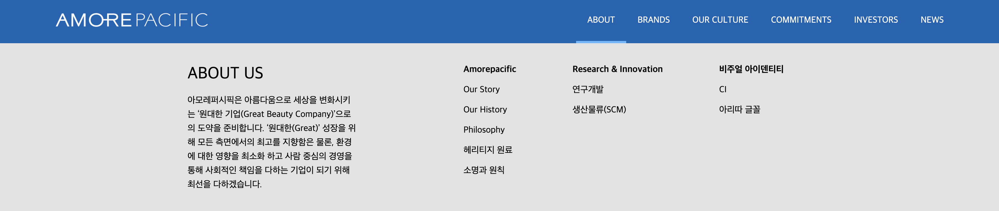
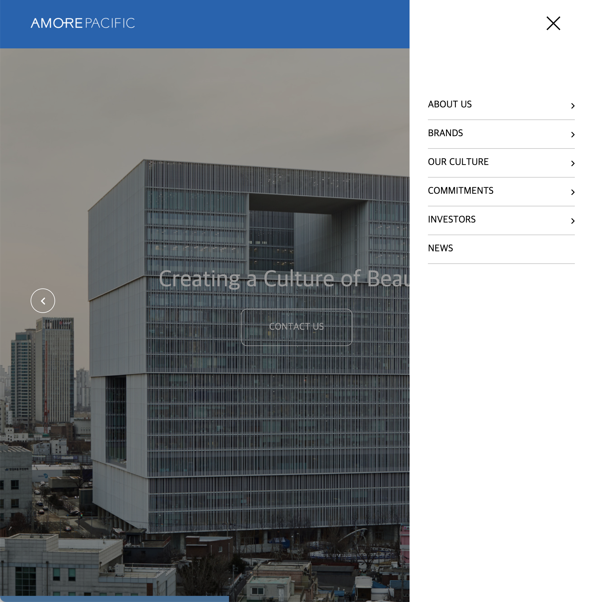
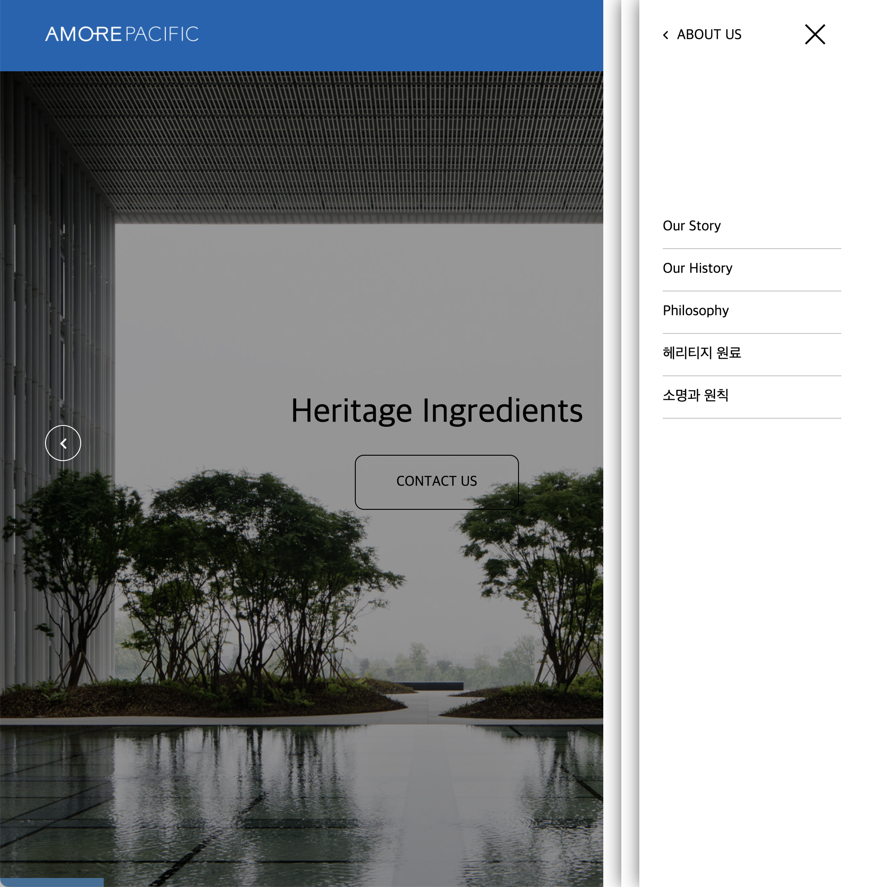

# Amorepacific
아모레퍼시픽 프로모션 웹사이트입니다.
프로그래밍이 목적이기에 디자인은 일반적으로 돌아다니는
레이아웃을 그래도 가져왔으며 기존 아모레퍼시픽 웹사이트를 참고하였습니다.

## 사용 언어
 - HTML, CSS, JavaScript
 기초적인 vanilla javascript를 연습하기 위하여 jQuery를 사용하지 않았습니다.

## 웹사이트 구성

### Header 
상단에 네비게이션과 로고를 배치하고 position : fixed; 로 고정켰습니다.

네비게이션바에 마우스 호버 시 텍스트 하단에 바가 따라다니며 해당하는 창이 뜨도록 제작하였습니다.

미디어쿼리를 사용하여 브라우저의 크기가 작아지면 햄버거바가 나타나게 하였습니다.

클릭시 좌측에서 창이 뜨도록 제작하였습니다. 창이 뜨고 사라지는것은

자바스크립트에서 toggle을 활용하여 class를 추가, 제거시켜 이벤트를 만들었습니다.

fontello 를 사용하여 아이콘을 넣었습니다.

    
    
    
    

